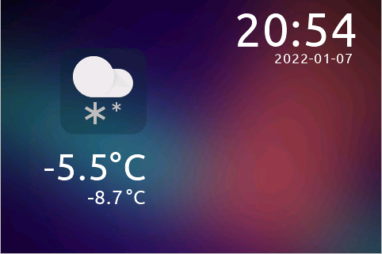
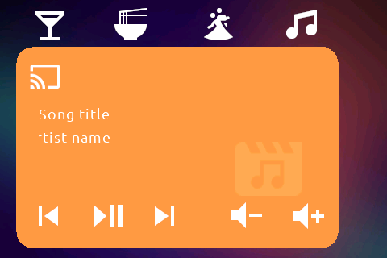
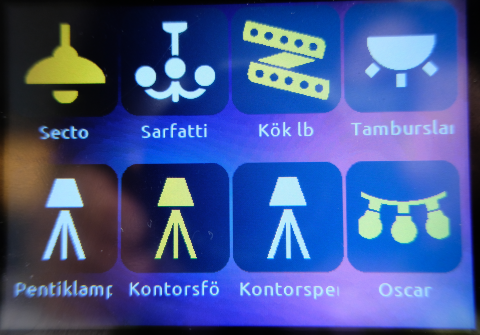
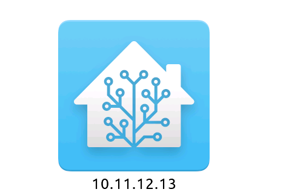

# NSPanel-MF
Custom HMI controlled by ESPHome for the Sonoff NSPanel. Includes home screen with weather data and clock, media player card, control of 8 lights (easily expandable), bootup screen and disable screen for alarm. Audible notifications can be sent from Home Assistant that remain visible on the screen for a set period of time. More to come.
All content on the screen can be controlled from ESPHome and is very easily integrated to Home Assistant.

[Youtube video](https://www.youtube.com/watch?v=2e5-53lGF94)

[Youtube video of notification function](https://youtu.be/fmObpwFJT7o)

## Credits
I created this based on information shared in the following forum threads:
[Home assistant thread](https://community.home-assistant.io/t/sonoff-nspanel-smart-scene-wall-switch-by-itead-coming-soon-on-kickstarter/332962/), 
[ESPHome thread](https://github.com/esphome/feature-requests/issues/1469)

Significant parts of the ESPHome config and ideas in the HMI are from [Masto](https://github.com/masto/NSPanel-Demo-Files/).

The HMI theme is based on the [Lovelace iOS dark mode theme](https://github.com/basnijholt/lovelace-ios-dark-mode-theme)

Weather icons are from [simple weather card](https://github.com/kalkih/simple-weather-card)

Light icons on the Lights-page are from [Hass BHA Icons](https://github.com/hulkhaugen/hass-bha-icons)

Other icons are from [Material Design Icons](https://materialdesignicons.com/)

The font is the Ubuntu font.

The ESPHome config yaml is based on [Masto's example config](https://github.com/masto/NSPanel-Demo-Files)

## HMI Screenshots

_Not all exposed entities are visible on the screenshot._ 
_The items look slightly poorly centered. This is to cope with the issue that the physical screen is larger than the visible area._

## Usage
The weather entities, media entities, lights etc. are selected in the ESPHome config. You can navigate between screens by touching the sides (right or left) in the center on the screen. The media player is on the left side, and the lights on the right side.
The config that is not done in ESPHome is done in Home Assistant.

In the example config a big part of the config is done in the ESPHome YAML file. If you prefer to set-and-forget it, you can replace the media entities, weather entities, light entities etc. with HA templates or input_text fields. That way you can re-configure everything directly from Home Assistant.

Any information and/or code found here is used on your own risk.

## Installation
1. Install and configure ESPHome.
2. Prepare the NSPanel for flashing (see instructions in the forum pages linked above).
3. Download the ESPHome sketch and adjust to your needs. Flash it to the NSPanel. Pay special attention to the _tft_url_ parameter and ensure it is accessible by the NSPanel.
4. Download the HMI file and save it to the _tft_url_ location.
5. Add the unit to Home Assistant through the ESPHome integration.
6. Run the _esphome.nspanel_upload_tft_ service from Home Assistant. This will download the HMI to the NSPanel. Please note that this will block the ESPHome connection during the update. Follow the progress on the HMI screen. When the HMI is installed, reboot the unit.
7. Configure the unit in Home Assistant to add actions to the buttons etc. it exposes.
8. Enjoy!

## TODO
Somewhat in a priority order:
- Control screen further:
  - Dim screen when not used and wake up when used. Further control from Home Assistant
- Add equipment page for vacuum robot, lawn mower robot, AC.
- Add electrical power monitoring page
